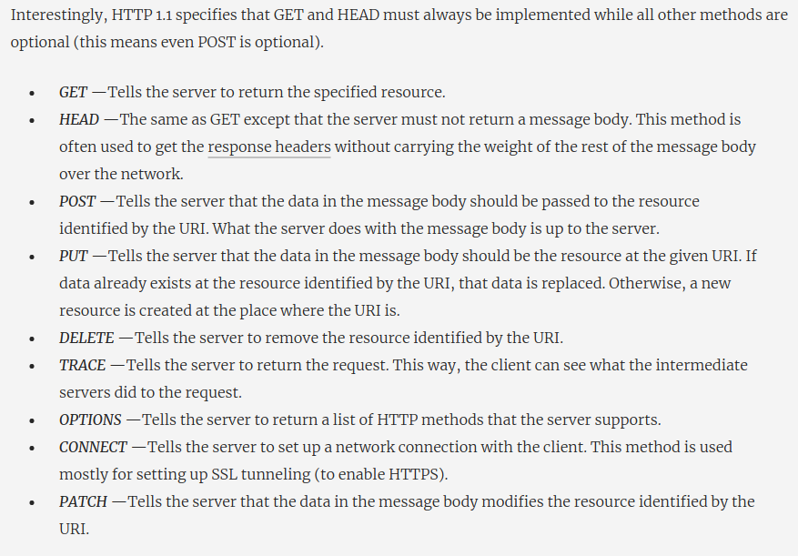
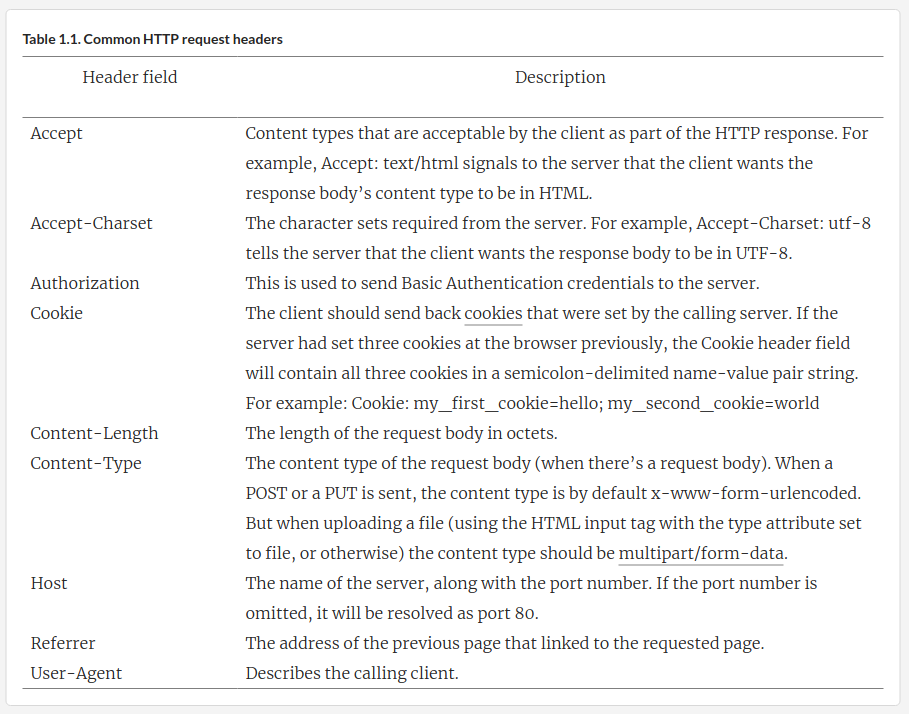

# B"H


### HTTP Request

The HTTP request, like any HTTP message, consists of a few lines of text in the following order:

1.  **Request-line**
    - The first word the **request method** 
    - Next is the **Uniform Resource Identifier (URI)** 
    - Next is the version of **HTTP** to be used
2.  Zero or more **request headers**
3.  An empty line
4.  The **message body** (optional)

This is how a typical HTTP request looks:

```http
GET /Protocols/rfc2616/rfc2616.html HTTP/1.1
Host: www.w3.org
User-Agent: Mozilla/5.0
(empty line)
```

---

### Request Methods




---

### Request Headers

Request headers are colon-separated name-value pairs in plain text, terminated by a carriage return (CR) and line feed (LF).

HTTP request headers are mostly optional. The only mandatory header in HTTP 1.1 is the Host header field. But if the message has a message body (which is optional, depending on the method), you’ll need to have either the **Content-Length** or the **Transfer-Encoding** header fields. 

