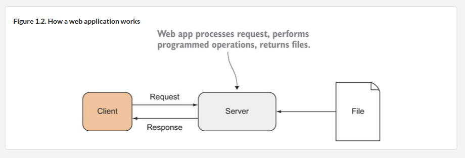

# B"H

### General Go Notes:

1. Whenever you see the word ***interface*** (in a Golang context) - replace the word in your head with ***Contract - Can You Do It?***
    - **CCYDI**

2. Functions can take interfaces, which means you can introduce new code into the system and still be able to use existing functions by implementing methods required by that interface.

### Go HTTP (Hypertext Transfer Protocol):

1. Knowing HTTP is the foundation to learning how to write web applications.

2. Basic Web App:

3. HTTP is the **application-level** communications protocol that powers the World Wide Web.

4. HTTP is a **stateless**, **text-based**, **request-response** protocol that uses the **client-server** computing model.