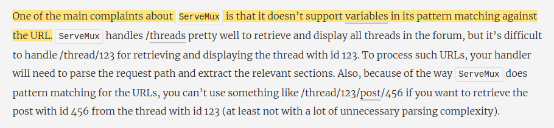
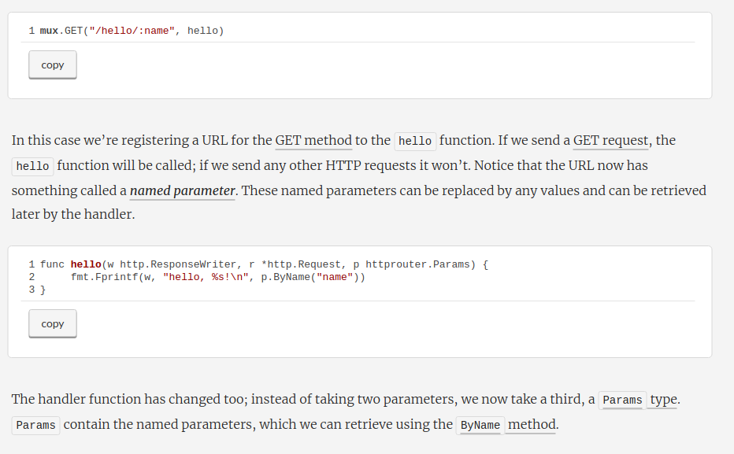

# B"H

### The ***httprouter*** Multiplexer





---

### Get Go module up and running:


```sh
# Create a new module (initialize the go.mod file) 
go mod init sandbox/testhttprouter

go run server.go
```

- http://localhost:8080/hello/moshe
