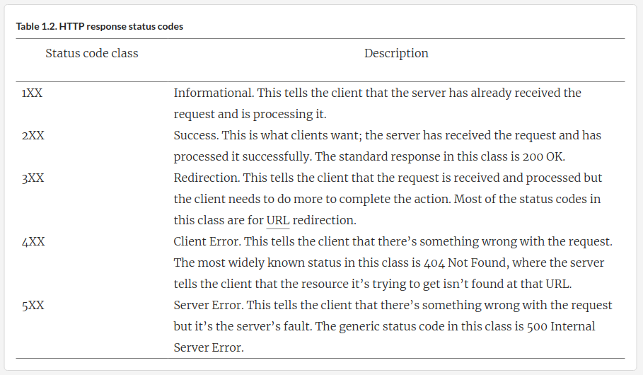
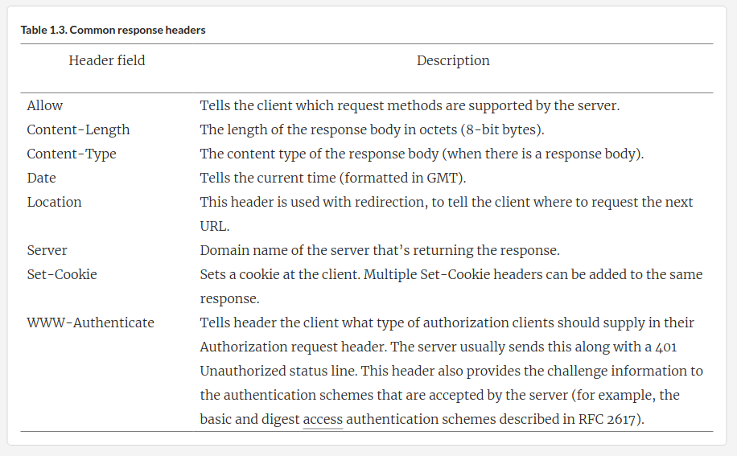

# B"H

### HTTP Response

1. A **status line**
    - First comes the **status code**, then a corresponding **reason phrase**, which is a short description of the code.
2. Zero or more **response headers**
3. An empty line
4. The **message body** (optional)

A typical HTTP response:

```http
200 OK
Date: Sat, 22 Nov 2014 12:58:58 GMT
Server: Apache/2
  Last-Modified: Thu, 28 Aug 2014 21:01:33 GMT
Content-Length: 33115
Content-Type: text/html; charset=iso-8859-1

<!DOCTYPE html PUBLIC "-//W3C//DTD XHTML 1.0 Strict//EN" "http://www.w3.org/
     TR/xhtml1/DTD/xhtml1-strict.dtd"> <html xmlns='http://www.w3.org/1999/
     xhtml'> <head><title>Hypertext Transfer Protocol -- HTTP/1.1</title></
     head><body>...</body></html>
```

---

### HTTP Response Status Codes



---

### HTTP Response Headers



