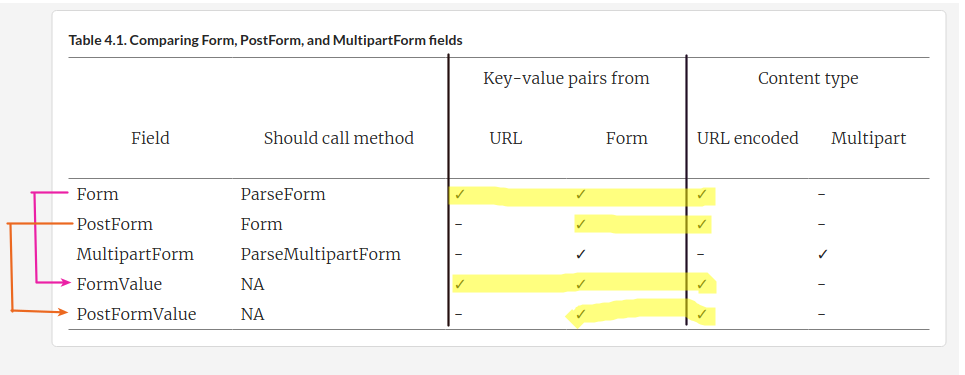

# B"H


### HTML forms and Go

The format of the **name-value pairs** sent through a **POST request** is specified by the **content type** of the HTML form. This is defined using the **`enctype` attribute** like this:

```html
<form 
    action  = "/process" 
    method  = "post" 
    enctype = "application/x-www-form-urlencoded">

    <input type="text" name="first_name"/>
    <input type="text" name="last_name"/>
    
    <input type="submit"/>

</form>
```

---

The default value for `enctype` is `application/x-www-form-urlencoded`. Browsers are required to support at least `application/x-www-form-urlencoded` and `multipart/form-data` (HTML5 also supports a `text/plain` value).

If we set `enctype` to `application/x-www-form-urlencoded`, the browser will encode in the HTML form data a long query string, with the name-value pairs separated by an ampersand (&) and the name separated from the values by an equal sign (=). 

Example:

```http
first_name=sau%20sheong&last_name=chang
```

---

If you set `enctype` to `multipart/form-data`, each name-value pair will be converted into a MIME message part, each with its own content type and content disposition.

Example:

```http
------WebKitFormBoundaryMPNjKpeO9cLiocMw
 Content-Disposition: form-data; name="first_name"

sau sheong
 ------WebKitFormBoundaryMPNjKpeO9cLiocMw
 Content-Disposition: form-data; name="last_name"

 chang
 ------WebKitFormBoundaryMPNjKpeO9cLiocMw--
```

---

#### When would you use one or the other? 

- If you’re sending simple text data, the URL encoded form is better - it’s simpler and more efficient and less processing is needed. 
- If you’re sending large amounts of data, such as uploading files, the multipart-MIME form is better. 

---

### GET Requests in an HTML form 

HTML allows the method attribute in form to be either POST or GET, so this is also a valid format:

```html
<form action="/process" method="get">
  <input type="text" name="first_name"/>
  <input type="text" name="last_name"/>
  <input type="submit"/>
</form>
``` 

In this case, there’s no request body (GET requests have no request body), and all the data is set in the URL as name-value pairs.

---

### Golang Ways to Access Form Data

**Note, there actually a few ways - see pages 74 - 82 for details.**
- However, in general, just use **`PostFormValue`**. 
- Unless you need key-value pairs from the URL or are uploading files.




- See `01-http/08-form/` example.

---

### Processing POST requests with JSON body

Remember, not all **POST requests** will come from **HTML forms**. 
- Sending **POST requests** is increasingly common with **client libraries** such as **JQuery** as well as **client-side frameworks** such as **Angular** or **Ember**.

**Client frameworks** encode their **POST requests** differently. 
- **JQuery** encodes **POST requests** like an **HTML form** with `application/x-www-form-urlencoded` (that is, it sets the **request header** **`Content-Type`** to `application/x-www-form-urlencoded`) 
- **Angular** encodes **POST requests** with `application/json`. 
- Etc.

In short, you'll need to see the client framework/library docs.