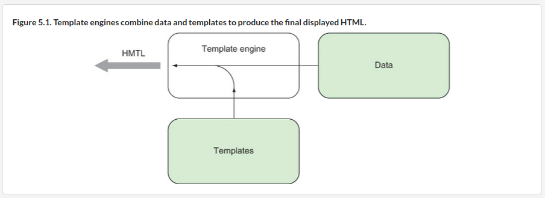
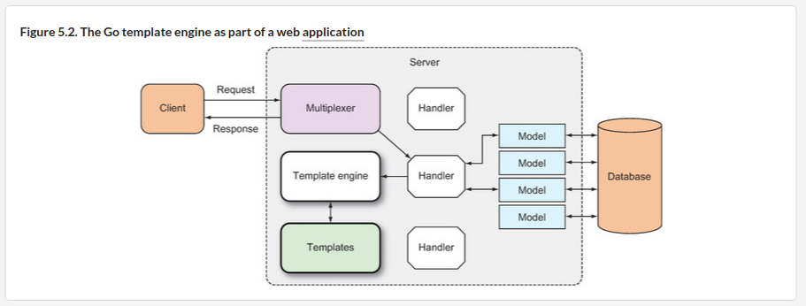

# B"H

### Templates and Template Engines

A **web template** is a predesigned HTML page that’s used repeatedly by a software program, called a **template engine**, to generate one or more HTML pages. 

---

- Go templates are text documents (for web apps, these would normally be HTML files), with certain commands embedded in them, called **actions**.  
- The text is parsed and executed by the **template engine** to produce another piece of text. 
- **Actions** are added between two double braces, `{{` and `}}` 

