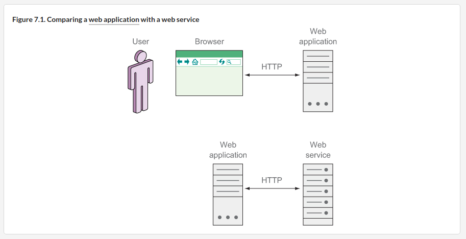
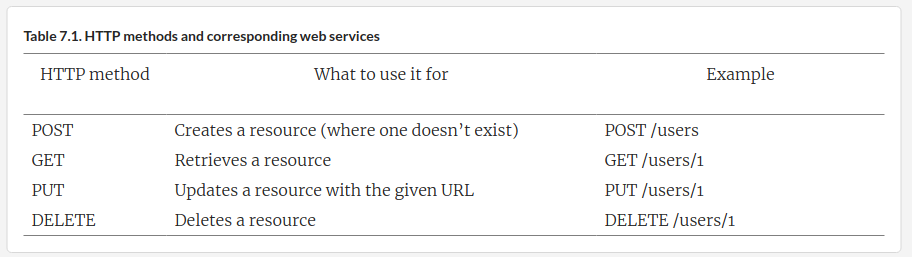
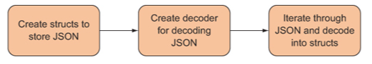
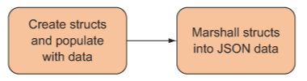
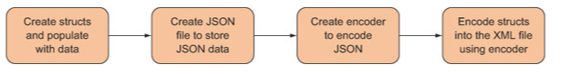

# B"H

### Web Services



---

### REST-based web services

See chapter 7 for details.



---

What about more complex services, or where you have to model some process or action?

For example, how do you activate a customer account? 
- REST doesn’t allow you to have arbitrary actions on the resources, and you’re more or less restricted to the list of available HTTP methods, so you can’t have a request that looks like this: `ACTIVATE /user/456 HTTP/1.1`

There are ways of getting around this problem; here are the two most common:

1. Reify the process or convert the action to a noun and make it a resource.

```http
POST /user/456/activation HTTP/1.1

{ "date": "2015-05-15T13:05:05Z" }
```

2. Make the action a property of the resource. 
    - This way, in general, is a lot easier to acheive (no complex URL parsing needed).

```http
PATCH /user/456 HTTP/1.1

{ "active" : "true" }
```

---

### Struct Tags
- Go uses them to determine the mapping between the struct and the JSON (can be other format like XML etc.) elements using them. 

The rules for mapping the structs to JSON using struct tags are easier than with XML. 
    - There is only **one** common rule for mapping. If you want to store the JSON value, given the JSON key, you create a field in the struct (with any name) and map it with the struct tag `json:"<name>"`, where `<name>` is the name of the JSON key.

**Struct JSON Tags Example:**

```go
type Post struct {
	Id       int       `json:"id"`
	Content  string    `json:"content"`
	Author   Author    `json:"author"`
	Comments []Comment `json:"comments"`
}
```

- **Struct tags** are strings after each field that are a key-value pair. 
- The key is a string and must not have a space, a quote `"`, or a colon `:`. 
- The value must be a string between double quotes `""`.
- Remember that **strings** in Go are created using the double quotes and backticks. Single quotes are used for **runes** (an int32 that represents a Unicode code point) only. 
- Note that because of the way Go does the mapping, the struct and all the fields in the struct that you create must be public, which means the names need to be capitalized.


---

### Marshalling
- In computer science, **marshalling** is the process of transforming the memory representation of an object to a data format suitable for storage or transmission.
- The inverse of **marshalling** is called **unmarshalling** (or **demarshalling**). 

---

### JSON-to-Structs 

**Approach 1:**


**Approach 2:**



**Important Note:**
So when do we use `Decoder` versus `Unmarshal`? 
 - That depends on the **input**. 
 - If your data is coming from an `io.Reader` **stream**, like the Body of an `http.Request`, use `Decoder`. 
 - If you have the data in a string or somewhere in memory, use `Unmarshal`.

---

### Structs-to-JSON

**Approach 1:**



**Approach 2:**



- Errata: should say JSON not XML.


