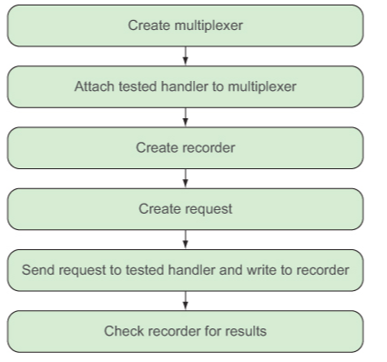

# B"H


### Testing

The `testing` package is used with the `go test` command which is used on any Go source files that end with `_test.go`. Usually this corresponds with the name of the source code file you’re testing, although that’s not strictly necessary.

For example:
- If you have a `server.go` file, you should also have a `server_test.go` file that contains all the tests you want to run on the server.go file. 
- The `server_test.go` file **must** be in the same package as the `server.go` file.

---

In the **test** file you create functions with the following form:

```go
func TestXxx(*testing.T) { ... }
```

- `Xxx` is any alphanumeric string in which the first letter is capitalized. 

---


---

To run tests in parallel call `t.Parallel()` in begining for test function.

---

### Benchmarking

Similar to unit testing, benchmark test cases are functions of the format:

```go
func BenchmarkXxx(*testing.B) { ... }
```

For example:

```go
func BenchmarkDecode(b *testing.B) {
  for i := 0; i < b.N; i++ {
    decode("post.json") 
  }
}
```

- As the code is being executed, `b.N` will change accordingly.

---

To run benchmark test cases, use the `-bench`. 
- You need to indicate which benchmark files you want to run using regular expressions as the flag parameter for the `-bench` flag. 
- To run all benchmarks files, just use the dot `.`.

```sh
go test -v -cover -short -bench .
```

Result:

```sh
BenchmarkDecode  100000     19480 ns/op
```

- The `100000` indicates how many loops were run (`b.N`). 
- In this example, 100,000 loops were run and **each** loop took 19,480 nanoseconds, or 0.01948 milliseconds. 
- The number of times a benchmark runs is dictated by Go. This number can’t be specified directly by the user, although you can specify the amount of time it has to run in, therefore limiting the number of loops run. 

---

If you want to keep it simple, you can ignore the functional tests by using `-run` flag. 
- The `-run` flag indicates which functional tests to run; if you use any name that doesn’t match the functional tests, the corresponding tests will be ignored.
- There are no functional tests named x, so no functional tests are run. 

```sh
go test -run x -bench .
```


---

### HTTP Testing 

The `httptest` package provides facilities to simulate a web server, allowing you to use the **client** functions of the `net/http` package to send an **HTTP request** and capturing the **HTTP response** that’s returned.

---

Let’s look at the **unit test** for when a **HTTP GET request** comes in:




---

### Test setup/teardown

Common test code (and other test fixtures) can be placed together in a setup function that prepares the test cases for execution.

Go's `testing` package provides a `TestMain` function that allows you to do whatever setup or teardown is necessary. 
- `setUp` and `tearDown` are functions you can define to do setup and teardown for all your test case functions. 
- Note that `setUp` and `tearDown` are run only once for all test cases. 
- The individual test case functions are called by calling `m.Run()`  
- `m.Run()` returns an exit code, which you can pass to the `os.Exit` function.

```go
func TestMain(m *testing.M) {
    setUp()
    code := m.Run()
    tearDown()
    os.Exit(code)
}
```