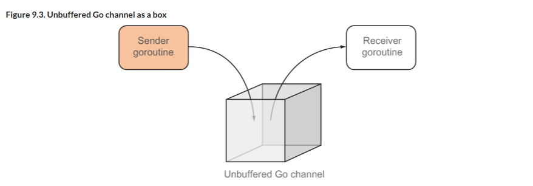
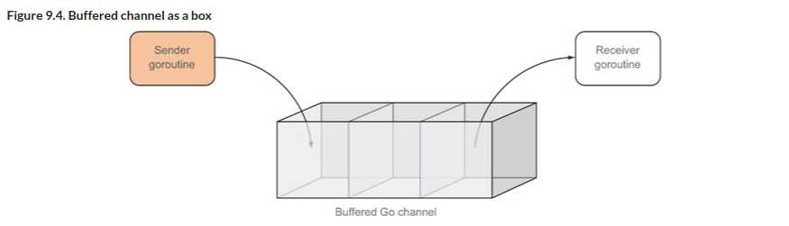

# B"H


### Concurrency

**Note, all the discussion below is just the tip of the iceberg for Go concurrency.**

> Concurrency is about dealing with lots of things at once. Parallelism is about doing lots of things at once.
>
> -- <cite>Rob Pike, co-creator of Go</cite>


---

**Parallel** programs that have to run tasks at the same time will need the environment variable `GOMAXPROCS` to be set to more than 1. Since Go 1.5, `GOMAXPROCS` is set to the number of CPUs available in the system. 

**Concurrent** programs can run within a single CPU and tasks scheduled to run independently. 

What’s important to note now is that although Go can be used to create parallel programs, **it was created with concurrency in mind and not parallelism**.

---

Go's support for concurrency is supported by two main constructs:
1. `goroutines` 
2. `channels`. 

--- 

### Waiting for goroutines

In `01-goroutine` and `02-goroutine-bench` you saw how:
1. goroutines are run independently
2. goroutines that started in the program would end unceremoniously when the program ended. You got away with it by adding a time delay using the Sleep function, but that’s a very hacky way of handling it.

You may often encounter a need to ensure all goroutines complete before moving on to the next thing.

Go provides a simple mechanism called the `WaitGroup`:

- Declare a `WaitGroup`.
- Set up the `WaitGroup`'s counter using the `Add` method.
- Decrement the counter using the `Done` method whenever a goroutine completes its task.
- Call the `Wait` method, which will block until the counter is 0.

The `WaitGroup` will block at the location where you call the `Wait` method until the counter becomes 0. 

What happens if you forget to decrement the counter in one of the goroutines? The WaitGroup blocks until the runtime detects all goroutines are asleep, after which it’ll panic:

```sh
fatal error: all goroutines are asleep - deadlock!
```

---


### Channels

You can think of a **channel** as a box. Goroutines can talk to each other only through this box. If a goroutine wants to pass something to another goroutine, it must place something in this box for the corresponding goroutine to retrieve:



---

Channels are **typed** values that allow goroutines to communicate with each other. 

Channels are allocated using `make`, and the resulting value is a **reference** to an underlying data structure. This, for example, allocates a channel of integers:

```go
ch := make(chan int)
```

---

#### Unbuffered Channels

Channels are, by default, **unbuffered**.  

Unbuffered channels are **synchronous**. You can think of unbuffered channels as a box that can contain only one thing at a time. Once a goroutine puts something into this box, no other goroutines can put anything in, unless another goroutine takes out whatever is inside it first. This means if another goroutine wants to put in something else when the box contains something already, it will block and go to sleep until the box is empty.

Similarly, if a goroutine tries to take out something from this box and it’s empty, it’ll block and go to sleep until the box has something in it.

---

#### Buffered Channels

**Buffered channels** are **asynchronous**, **first-in, first-out (FIFO)** message queues. 

A goroutine can continually add things into this box without blocking until there’s no more space in the box. Similarly, another goroutine can continually remove things from this box (in the same sequence it was put in) and will only block when it runs out of things to remove

Buffered channels are useful when limiting throughput. If you have a limited number of processes to work on your problem and you want to throttle the number of requests coming in to your processes, buffered channels allow you to do exactly that.



This creates a **buffered channel** of integers with the size 10:

```go 
ch := make(chan int, 10)
```

---

#### Using Channels

This puts an integer 1 into the channel ch:

```go
ch <- 1
```


This removes the value from the channel and assigns it to the variable i:

```go
i := <- ch
```

---

Channels can be **directional**. By default, channels work both ways (**bidirectional**) and values can be sent to or received from it. But channels can be restricted to send-only or receive-only. 

This allocates a **send-only** channel of strings:

```go
ch := make(chan <- string)
```

This allocates a **receive-only** channel of strings:

```go
ch := make(<-chan string)
```

---

Although channels can be allocated to be directional, they can also be allocated as bidirectional but returned as directional. You’ll see an example of this near the end of this chapter.

---

### Selecting Channels

Go has a special keyword, `select`, that allows you to select one of many channels to receive from or send to. Think of the `select` statement like a `switch` statement but for channels.

---

**Closing Channels**
- Channels can be closed using the `close` built-in function. 
- Closing a channel indicates to the **receiver** that no more values will be sent to the channel. 
- Sending to or closing an already closed channel causes a panic.
- A closed channel is never blocked and always returns the zero value for the channel’s type.
- Note, you can't close a **receive-only** channel. 
- It's perfectly all right not to close them. As mentioned, closing channels just means telling the receiver that nothing else is coming through. 

