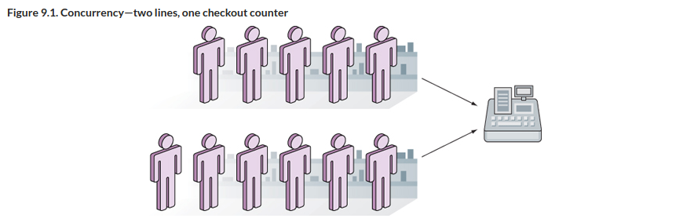
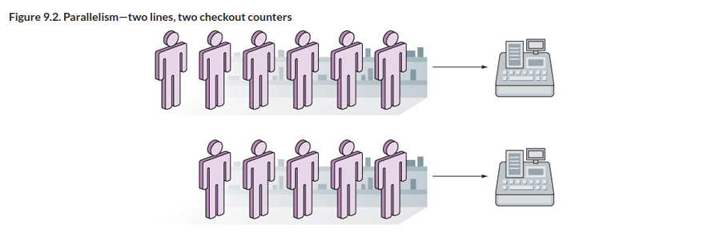

# B"H


### Concurrency

> Concurrency is about dealing with lots of things at once. Parallelism is about doing lots of things at once.
>
> -- <cite>Rob Pike, co-creator of Go</cite>





---

**Parallel** programs that have to run tasks at the same time will need the environment variable `GOMAXPROCS` to be set to more than 1. Since Go 1.5, `GOMAXPROCS` is set to the number of CPUs available in the system. 

**Concurrent** programs can run within a single CPU and tasks scheduled to run independently. 

What’s important to note now is that although Go can be used to create parallel programs, **it was created with concurrency in mind and not parallelism**.

---

Go's support for concurrency is supported by two main constructs:
1. `goroutines` 
2. `channels`. 

--- 

### Waiting for goroutines

In `01-goroutine` and `02-goroutine-bench` you saw how:
1. goroutines are run independently
2. goroutines that started in the program would end unceremoniously when the program ended. You got away with it by adding a time delay using the Sleep function, but that’s a very hacky way of handling it.

You may often encounter a need to ensure all goroutines complete before moving on to the next thing.

Go provides a simple mechanism called the `WaitGroup`:

- Declare a `WaitGroup`.
- Set up the `WaitGroup`'s counter using the `Add` method.
- Decrement the counter using the `Done` method whenever a goroutine completes its task.
- Call the `Wait` method, which will block until the counter is 0.

The `WaitGroup` will block at the location where you call the `Wait` method until the counter becomes 0. 

What happens if you forget to decrement the counter in one of the goroutines? The WaitGroup blocks until the runtime detects all goroutines are asleep, after which it’ll panic:

```sh
fatal error: all goroutines are asleep - deadlock!
```

---
